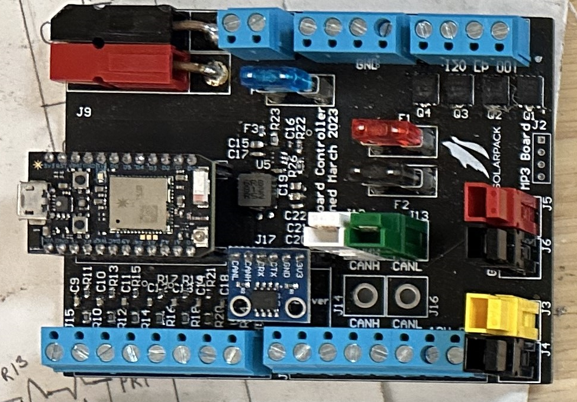
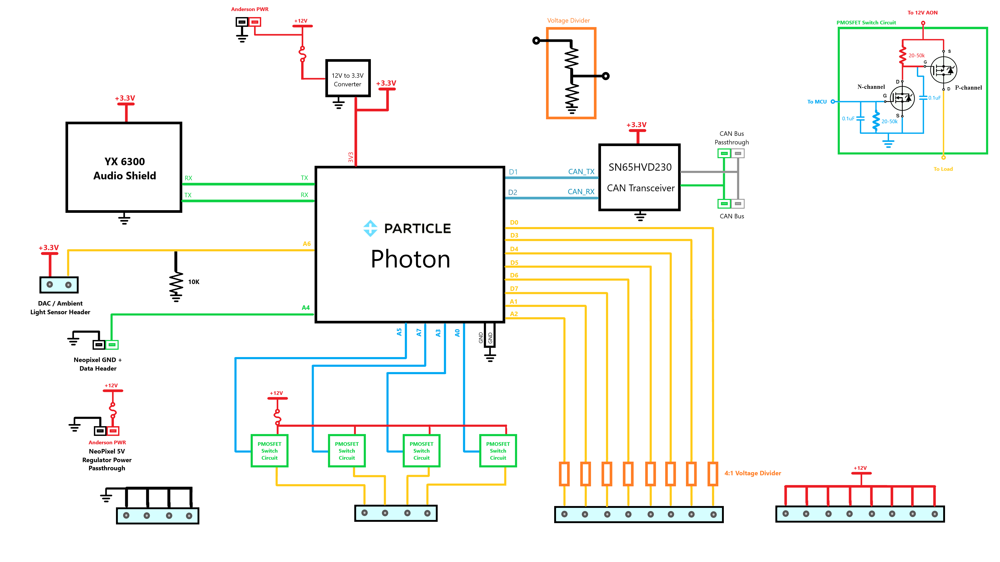
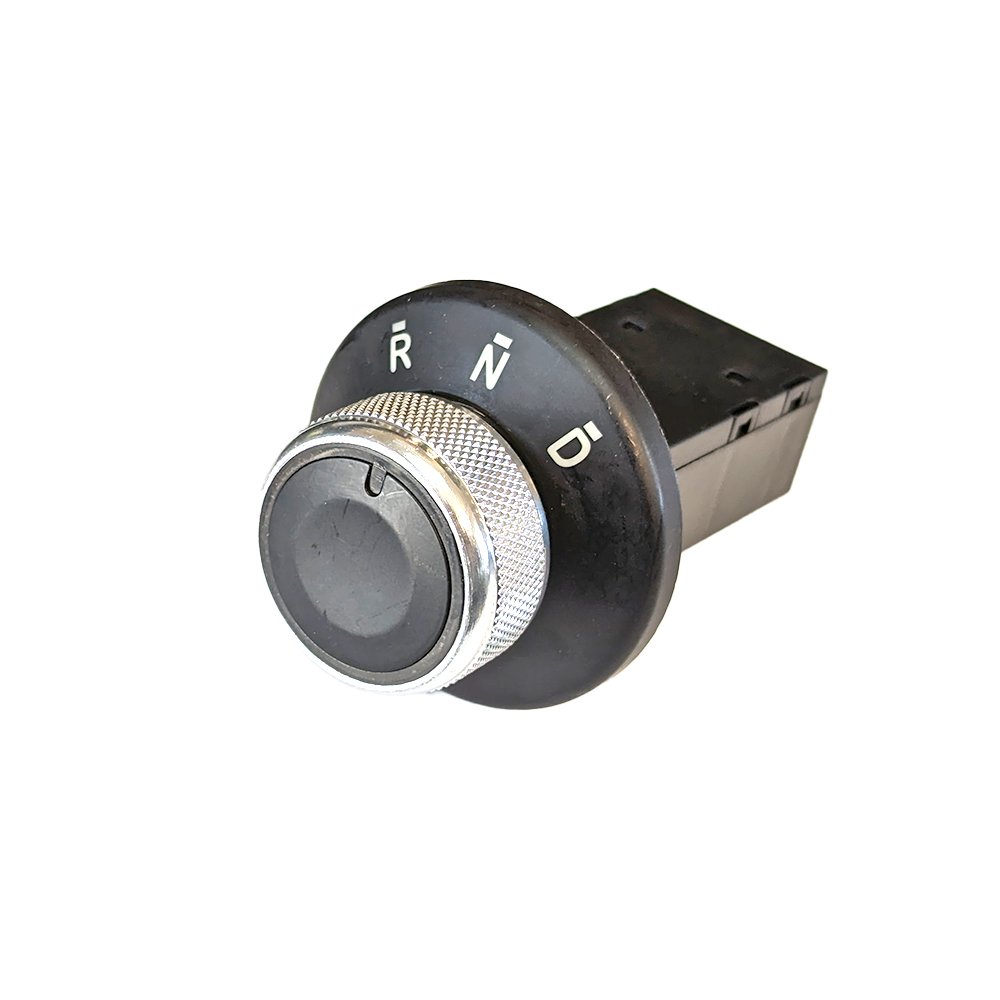
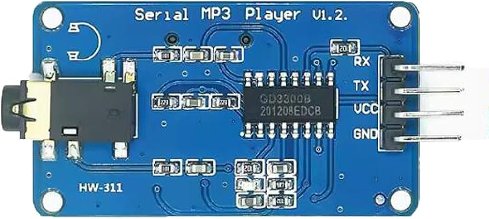
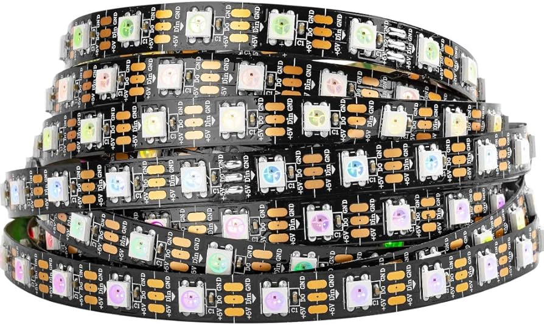
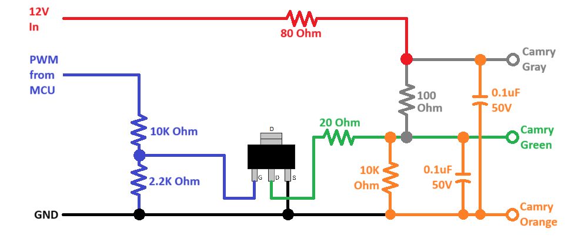
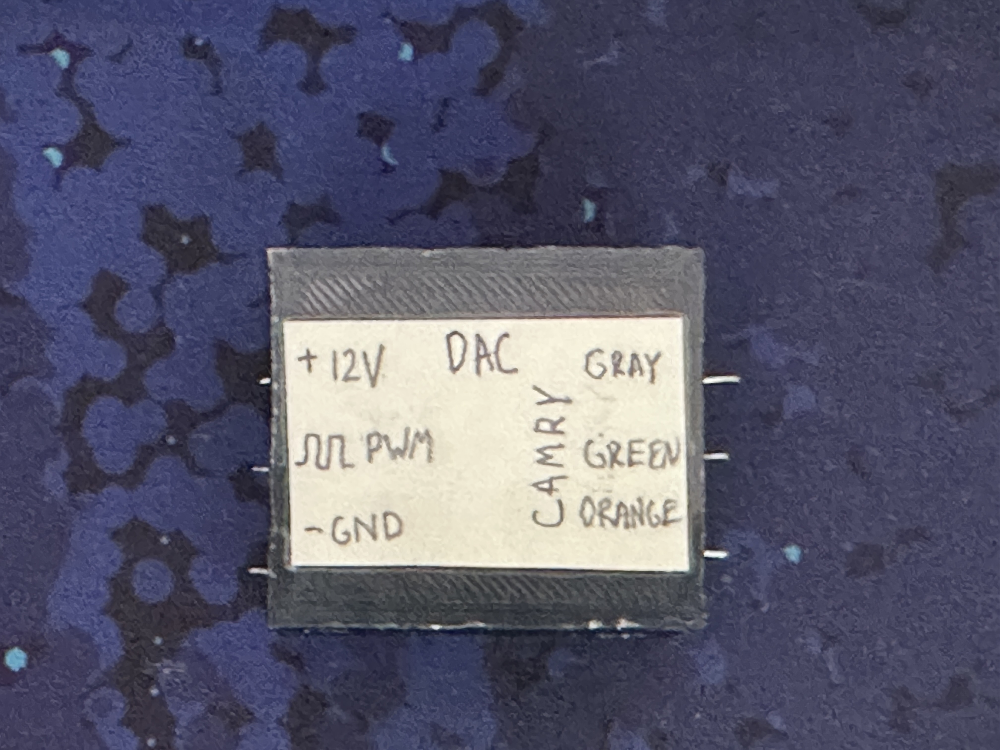
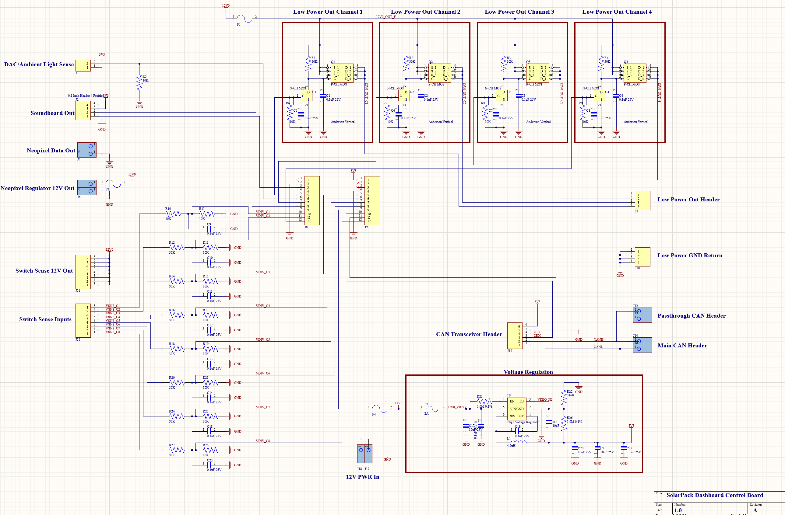
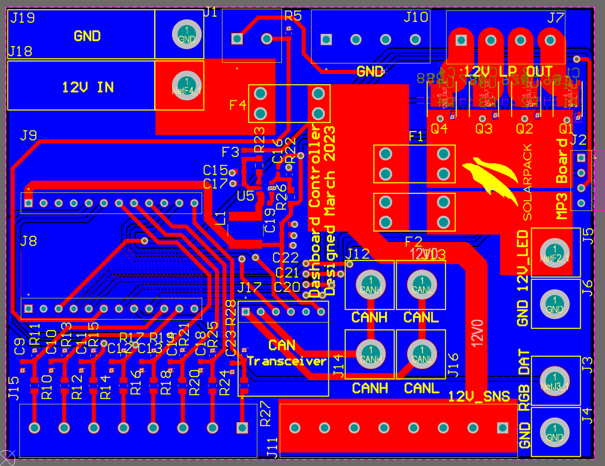

# DecentralizedLV-DashController
Software Repository for Dashboard Controller

## Project Overview

The DecentralizedLV Dash Controller has the primary role of receiving button inputs from the driver and controlling the [Camry Instrument Cluster](https://github.com/matthewpanizza/CANAnalyzer). It is based on code from the [DecentralizedLV-Sense](https://github.com/matthewpanizza/DecentralizedLV-Sense) board. See the main [DecentralizedLV-Documentation](https://github.com/matthewpanizza/DecentralizedLV-Documentation) repository for information about the DecentralizedLV system and how to set up the software environment for programming this board.

## Block Diagram

## Hardware Capabilities
- 2X PWM-Capable [Low-power driver pins](https://github.com/matthewpanizza/DecentralizedLV-Documentation?tab=readme-ov-file#low-power-output-pins-supply-power-to-low-power-devices-less-than-5-amps) (A3 and A5) (P-MOSFET Configuration)
- 2X Non-PWM [Low-power driver pins](https://github.com/matthewpanizza/DecentralizedLV-Documentation?tab=readme-ov-file#low-power-output-pins-supply-power-to-low-power-devices-less-than-5-amps) (A0 and A7) (P-MOSFET Configuration)
- 8X [Sense Pins](#https://github.com/matthewpanizza/DecentralizedLV-Documentation?tab=readme-ov-file#sense-pins-read-binary-onoff-switches-or-12v-signals) (4:1 voltage divider ratio)
- [Neopixel](https://github.com/matthewpanizza/DecentralizedLV-Documentation?tab=readme-ov-file#addressable-led-strips-neopixel) Data Output
- [Neopixel](https://github.com/matthewpanizza/DecentralizedLV-Documentation?tab=readme-ov-file#addressable-led-strips-neopixel) Power Regulator Supply (attach 12V to 5V regulator)
- MP3 Player (YX6300) for soundboard
- Photoresistor header for ambient light sensing
- 8X 12V passthrough header for connecting switches to sense pins
- 4X GND passthrough header for low-power driver devices

## Important Roles
- Determines the drive mode (forward, reverse, park) based on a rotary knob using sense pins
- Relays the drive mode to the [Power Controller]() for commanding the motor controller
- Commands the [LPDRV](https://github.com/matthewpanizza/DecentralizedLV-Documentation?tab=readme-ov-file#low-power-output-pins-supply-power-to-low-power-devices-less-than-5-amps) boards about the state of the headlights, turn signals, brakes, pumps, fans, etc based on the dashboard's switches.
- Commands the [Camry Instrument Cluster](https://github.com/matthewpanizza/CANAnalyzer#chapter-2-2018-camry-instrument-cluster) and changes its indicators based on data from other parts in the system (fuel level, BMS/Motor errors, headlights, speed)
- Controls a [Neopixel strip](https://github.com/matthewpanizza/DecentralizedLV-Documentation?tab=readme-ov-file#addressable-led-strips-neopixel) on the dasboard for decorative purposes or for indication of other statistics

### CAN Bus Communication

CAN Bus communication is handled using the [DecentralizedLV-Boards API](https://github.com/matthewpanizza/DecentralizedLV-Boards) submodule for sending and receiving messages. The submodule also has the CAN message encoding and decoding for this board and other boards in the system. Check out the [Boards API DashController Section](https://github.com/matthewpanizza/DecentralizedLV-Boards?tab=readme-ov-file#dashcontroller_can) for the CAN message encoding. Check out the [DecentralizedLV-Documentation](https://github.com/matthewpanizza/DecentralizedLV-Documentation) repository for information about CAN Bus communication.

### Drive Mode Selection

The system allows the driver to select different drive modes using a switch. We are using this rotary switch for a golf cart for selecting forward or reverse. This information is relayed over CAN to the DecentralizedLV-PowerController which then commands the motor controller which direction to spin.

The rotary dial has internal connections for each the forward and reverse pins. Two of the eight [sense pins](https://github.com/matthewpanizza/DecentralizedLV-Documentation?tab=readme-ov-file#sense-pins-read-binary-onoff-switches-or-12v-signals) are used to read the binary signal for forward and reverse. Information about the drive gear needs to be passed to the Camry Instrument Cluster and to the Power Controller.

### YX6300 Sound Board

The Dash Controller also has a port for controlling a YX6300 soundboard. This module reads data from a microSD card (on the back of the board) and plays audio out of the aux port. This can be used for startup sounds or fun horns.

This is not yet implemented in software, but here is an article for how to [control this module using an Arduino](https://electropeak.com/learn/interfacing-yx6300-serial-mp3-player-with-arduino/). To port this to the Photon, you can just replace the functions called from the `SoftwareSerial` class with `Serial1`, as the Photon has native Serial support.

 
### Neopixel Control

There are hardware outputs on this board to allow for control of a Neopixel RGB LED strip. Most Neopixels require a 5-Volt power supply, so there is an Anderson connector pair which outputs 12V for powering a 12V to 5V regulator. Below is a picture of some of the Neopixel strips.

These strips can be obtained for < [$20 on Amazon](https://www.amazon.com/s?k=addressable+led+strip+144&crid=2U40124KZTEXO&sprefix=addressable+led+strip+144%2Caps%2C134&ref=nb_sb_noss_1) and have different options for density of the LEDs. Pictured is a 60 LED/meter strip, but full density of 144 LEDs/meter would be recommended. Currently, there is not any software control of the Neopixel strip on the Dash Controller, but you could use this to display battery charge, a battery management system fault, percentage of charge or low power mode.

### Camry Instrument Cluster Control

This board has the important role of collecting information from the rest of the DecentralizedLV system and passing information that needs to be displayed to the driver via the Camry Instrument Cluster. The instrument cluster has a series of CAN Bus messages is responds to which are present in the [Boards API](https://github.com/matthewpanizza/DecentralizedLV-Boards). See the `dashSpoof()` function for how parameters are mapped for the instrument cluster.

The instrument cluster also has a strange mechanism for controlling the fuel level dial. In the Camry, it uses a bobber in the gas tank that produces a hall-effect output (PWM? DAC?). Not entirely sure how it works, but we've managed to find a way to spoof the input. Below is a mechanism that takes a 12V PWM signal and generates a DAC-style output based on the duty cycle:

To use this circuit, you will need to connect the 12V and GND signals to the same Low-Power Driver pins used to power the instrument cluster. The PWM signal is driven using another one of the Low-Power Driver pins (Pin A5 to be exact since this one supports PWM). On the instrument cluster wiring harness, there are three wires that need to be connected to this circuit, based on the color code shown in the image. In software, you can then call `analogWrite()` on A5. The fuel percentage will be based on the duty cycle, where higher duty cycle displays more fuel in the tank. This duty cycle should be based on the battery state of charge coming from the Orion battery management system. Here's the DAC circuit packaged up into a nice little box:

### PCB Schematic / Boardview

